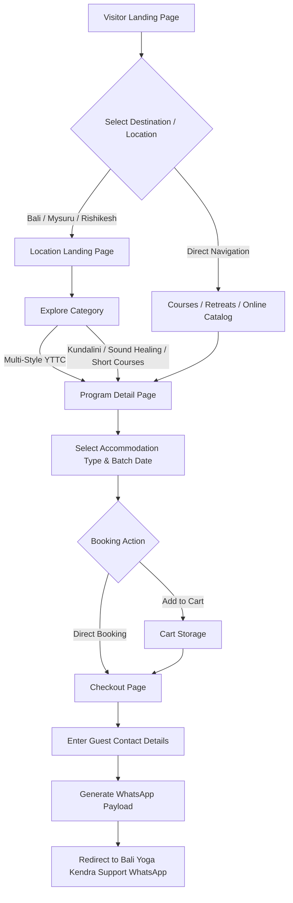
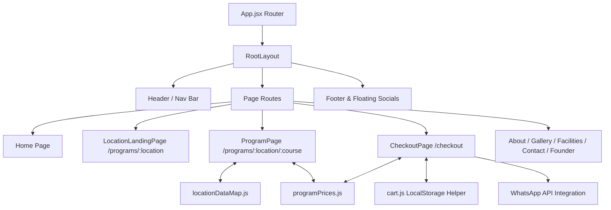
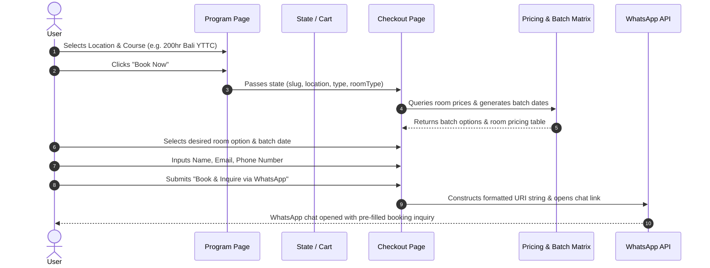

# 🧘 Bali Yoga Kendra - Web Application

An intuitive web platform for **Bali Yoga Kendra** designed for discovering, exploring, and booking Yoga Teacher Training Courses (YTTC), Retreats, Specialization Workshops, and Online Classes across global spiritual hubs like **Bali, Mysuru, and Rishikesh**.

---

## 📌 Table of Contents
- [Overview](#-overview)
- [Key Features](#-key-features)
- [Tech Stack](#-tech-stack)
- [System Flows & Architecture](#-system-flows--architecture)
  - [1. User Navigation Flow](#1-user-navigation-flow)
  - [2. Component & System Architecture](#2-component--system-architecture)
  - [3. Dynamic Checkout & Inquiry Data Flow](#3-dynamic-checkout--inquiry-data-flow)
- [Project Directory Structure](#-project-directory-structure)
- [Getting Started](#-getting-started)
- [Scripts & Deployment](#-scripts--deployment)
- [License](#-license)

---

## 🌿 Overview

**Bali Yoga Kendra** connects global yoga practitioners with accredited teacher training courses (100hr, 200hr, 300hr, 500hr), Kundalini awakening sessions, Sound Healing, Aerial, Yin, and Ayurveda courses. The application features a dynamic location-based routing system, real-time room pricing matrix, automated batch date generation, and a seamless WhatsApp-based inquiry and booking checkout.

---

## ✨ Key Features

- **Multi-Location Hub**: Dedicated course offerings tailored for **Bali**, **Mysuru**, **Rishikesh**, **Chiang Mai**, and **Dharamshala**.
- **Dynamic Program Pages**: Centralized routing system mapping URLs to course data structures based on location, course type, and duration.
- **Google Sheets Automated Pricing & Batches**: Fetches and computes base pricing, accommodation room tiers, and upcoming course batch dates dynamically from Google Sheets CSV endpoints on app load.
- **Sacred Bali Activities & Excursions**: Dedicated catalog showing curated local experiences and booking details (Uluwatu Kecak, Mt. Batur, Snorkeling, etc.) at `/bali-activities`.
- **Flexible Accommodation & Pricing Matrix**: Real-time room type selection (Single, Shared, Deluxe, Private) with instant pricing adjustments.
- **WhatsApp Inquiry & Checkout Flow**: Bypasses complex payment gateways by compiling reservation configurations directly into structured WhatsApp messages for instant support coordination.
- **Cart & Direct Checkout Modes**: Supports single-click direct course checkout or multi-item cart management.
- **Rich Media & Interactive UI**: Photo/Video galleries, interactive sliders using Swiper, smooth animations with Framer Motion, and mobile-first responsive navigation.

---

## 🛠 Tech Stack

| Category | Technology |
| :--- | :--- |
| **Frontend Framework** | [React 19](https://react.dev/) + [Vite 7](https://vite.dev/) |
| **Routing** | [React Router v7](https://reactrouter.com/) |
| **Styling** | [Tailwind CSS v4](https://tailwindcss.com/) |
| **Animations** | [Framer Motion](https://www.framer.com/motion/) |
| **Icons** | [Lucide React](https://lucide.dev/) & [React Icons](https://react-icons.github.io/react-icons/) |
| **Sliders / Carousels** | [Swiper JS](https://swiperjs.com/) |
| **Deployment** | [Vercel](https://vercel.com/) (Single-Page Application rewrite rules enabled) |

---

## 🔄 System Flows & Architecture

### 1. User Navigation Flow

The flow chart below illustrates the user journey from entering the landing page to completing a course inquiry:



---

### 2. Component & System Architecture

The client application architecture relies on React Router v7 and data maps to provide dynamic page rendering without redundant code duplication:



---

### 3. Dynamic Checkout & Inquiry Data Flow

How user selection and price data flow into the checkout system:



---

## 📁 Project Directory Structure

```text
Baliyoga/
├── public/                 # Static public assets (logo, icons)
├── src/
│   ├── assets/             # Global visual assets (images, vectors)
│   ├── components/         # Modular React components
│   │   ├── layout/         # Root layout, Header, Footer
│   │   └── shared/         # Reusable UI components (ScrollToTop, cards, carousel)
│   ├── data/               # Single source of truth data maps
│   │   ├── locations.js     # Master list of locations & program routes
│   │   ├── locationDataMap.js # Centralized course details & hero content
│   │   ├── bali/           # Bali specific pricing matrices & activities
│   │   ├── mysore/         # Mysore specific pricing matrices
│   │   └── rishikesh/      # Rishikesh specific pricing matrices
│   ├── pages/              # Application views & pages
│   │   ├── Home/           # Landing page sections & activity cards
│   │   ├── Program/        # Dynamic program detail view
│   │   ├── programsCard/   # Location landing page views
│   │   ├── Checkout/       # Inquiry & Checkout workflow
│   │   ├── gallery/        # Photo & Video galleries
│   │   ├── contact/        # Contact form & location sections
│   │   ├── founder/        # Founder bio & story
│   │   └── activities/     # Sacred Bali activities & excursions pages
│   ├── utils/              # Helper utilities & dynamic pricing from Google Sheets
│   ├── App.jsx             # React Router route definitions & sheet fetching hook
│   ├── main.jsx            # Application root entry point
│   └── index.css           # Tailwind CSS directives & global styling
├── eslint.config.js        # ESLint code quality rules
├── package.json            # Dependencies & npm scripts
├── vercel.json             # Vercel SPA routing configuration
└── vite.config.js          # Vite build configuration
```

---

## 🚀 Getting Started

### Prerequisites
Make sure you have **Node.js** (v18.x or higher) and **npm** installed on your system.

### 1. Clone the Repository
```bash
git clone https://github.com/your-username/baliyoga.git
cd baliyoga
```

### 2. Configure Environment Variables
Create a `.env` file in the root directory and configure the Google Sheet CSV export URLs:
```env
# Google Sheet CSV Integration Endpoints
VITE_SPREADSHEET_ID_PROGRAM=https://docs.google.com/spreadsheets/d/e/.../pub?output=csv&gid=905979125
VITE_SPREADSHEET_ID_ROOM=https://docs.google.com/spreadsheets/d/e/.../pub?output=csv&gid=396782719
VITE_SPREADSHEET_ID_BATCHES=https://docs.google.com/spreadsheets/d/e/.../pub?output=csv&gid=1930415554
```

### 3. Install Dependencies
```bash
npm install
```

### 4. Run Development Server
```bash
npm run dev
```
Open your browser and navigate to `http://localhost:5173`.

---

## 📜 Scripts & Deployment

### Available Scripts

- **`npm run dev`**: Starts Vite dev server with Hot Module Replacement (HMR).
- **`npm run build`**: Builds optimized production bundle in the `dist` folder.
- **`npm run preview`**: Previews the production build locally.
- **`npm run lint`**: Runs ESLint checks across the codebase.

### Deployment (Vercel)

This application is ready for zero-config deployment on Vercel.

The `vercel.json` file ensures proper handling of client-side routing:
```json
{
  "rewrites": [
    { "source": "/(.*)", "destination": "/" }
  ]
}
```

---

## 📄 License

This project is maintained for **Bali Yoga Kendra**. All rights reserved.
